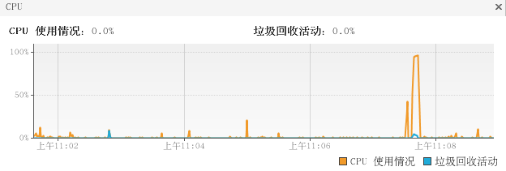
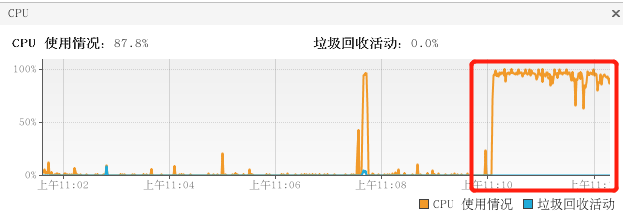

# 安装

- 从github上下载当前版本 chaosblade-0.5.0-linux-amd64.tar.gz
- 下载地址 https://chaosblade.oss-cn-hangzhou.aliyuncs.com/agent/github/0.5.0/chaosblade-0.5.0-linux-amd64.tar.gz  

- 使用环境centOS6.8，jdk1.8
- 解压chaosblade-0.5.0-linux-amd64.tar.gz到/opt/module目录下

- 解压后的目录

```bash
[root@stt module]# tree chaosblade-0.5.0/
chaosblade-0.5.0/
├── bin
│   ├── chaosblade-cplus-spec.yaml
│   ├── chaosblade-docker-spec-0.5.0.yaml
│   ├── chaosblade-jvm-spec-0.5.0.yaml
│   ├── chaosblade-k8s-spec-0.5.0.yaml
│   ├── chaosblade-os-spec-0.5.0.yaml
│   ├── chaos_burncpu
│   ├── chaos_burnio
│   ├── chaos_burnmem
│   ├── chaos_changedns
│   ├── chaos_dropnetwork
│   ├── chaos_filldisk
│   ├── chaos_killprocess
│   ├── chaos_stopprocess
│   ├── chaos_tcnetwork
│   └── tools.jar			#如果有JAVA_HOME，则使用JAVA_HOME的tools.jar，没有则使用自带的
├── blade   				#可执行文件，chaosblade的 cli，混沌实验执行的工具
├── chaosblade.dat			#sqllite数据库的数据存储文件
├── lib
│   ├── cplus 				# C++的支持
│   │   ├── chaosblade-exec-cplus.jar
│   │   └── script
│   │       ├── shell_break_and_return_attach.sh
│   │       ├── shell_break_and_return.sh
│   │       ├── shell_check_process_duplicate.sh
│   │       ├── shell_check_process_id.sh
│   │       ├── shell_initialization.sh
│   │       ├── shell_modify_variable_attch.sh
│   │       ├── shell_modify_variable.sh
│   │       ├── shell_remove_process.sh
│   │       ├── shell_response_delay_attach.sh
│   │       └── shell_response_delay.sh
│   └── sandbox				# 使用jvm-sandbox对java程序的支持
│       ├── bin
│       │   └── sandbox.sh
│       ├── cfg
│       │   ├── sandbox-logback.xml
│       │   ├── sandbox.properties
│       │   └── version
│       ├── example
│       │   └── sandbox-debug-module.jar
│       ├── install-local.sh
│       ├── lib
│       │   ├── sandbox-agent.jar
│       │   ├── sandbox-core.jar
│       │   └── sandbox-spy.jar
│       ├── module
│       │   ├── chaosblade-java-agent-0.5.0.jar      #chaoblades的java-agent
│       │   └── sandbox-mgr-module.jar
│       └── provider
│           └── sandbox-mgr-provider.jar
└── logs
    └── chaosblade.log   		#操作日志

12 directories, 41 files
```


# 查看帮助

- 使用-h 或者 --help进行

```bash
[root@stt chaosblade-0.5.0]# ./blade --help
An easy to use and powerful chaos engineering experiment toolkit

Usage:
  blade [command]

Available Commands:
  create      Create a chaos engineering experiment
  destroy     Destroy a chaos experiment
  help        Help about any command
  prepare     Prepare to experiment
  query       Query the parameter values required for chaos experiments
  revoke      Undo chaos engineering experiment preparation
  server      Server mode starts, exposes web services
  status      Query preparation stage or experiment status
  version     Print version info

Flags:
  -d, --debug   Set client to DEBUG mode
  -h, --help    help for blade

# 每个子命令可以通过--help查看更多的信息
Use "blade [command] --help" for more information about a command.
```


# 实验：模拟服务器CPU满载

- 先查看cpu情况

```bash
[root@stt chaosblade-0.5.0]# top
top - 22:50:08 up  1:19,  4 users,  load average: 0.00, 0.01, 0.05
Tasks: 151 total,   1 running, 150 sleeping,   0 stopped,   0 zombie
Cpu(s):  0.3%us,  0.0%sy,  0.0%ni, 99.3%id,  0.0%wa,  0.0%hi,  0.3%si,  0.0%st
...
```

- 使用命令创建一个混沌实验

```bash
[root@stt chaosblade-0.5.0]# ./blade create cpu fullload
# 返回的result是当前创建的混沌实验的id
{"code":200,"success":true,"result":"9825573a824f2de6"}
```

- 此时查看cpu情况，us是100%使用

```bash
[root@stt ~]# top
top - 23:19:30 up  1:48,  5 users,  load average: 0.99, 1.39, 0.83
Tasks: 154 total,   1 running, 153 sleeping,   0 stopped,   0 zombie
Cpu(s): 99.6%us,  0.4%sy,  0.0%ni,  0.0%id,  0.0%wa,  0.0%hi,  0.0%si,  0.0%st
Mem:   1004136k total,   872404k used,   131732k free,    15736k buffers
Swap:  2098172k total,      616k used,  2097556k free,   475152k cached
   PID USER      PR  NI  VIRT  RES  SHR S %CPU %MEM    TIME+  COMMAND 
  3906 root      20   0  109m 7616 3216 S 99.8  0.8   0:14.53 chaos_burncpu # chaos进程占用cpu100%  
...
```

- 实验结束，销毁实验

```bash
[root@stt chaosblade-0.5.0]# ./blade destroy 9825573a824f2de6
{"code":200,"success":true,"result":"command: cpu fullload "}
```


# 实验：启动blade服务，通过url的方式模拟服务器cpu 50%负载


## 开启服务器

- 启动blade服务，指定端口是8888

```bash
[root@stt chaosblade-0.5.0]# ./blade server start -p 8888
success, listening on :8888
# 查看进程
[root@stt chaosblade-0.5.0]# ps aux | grep 8888
root       3660  0.2  2.1 131768 21664 pts/3    Sl   23:26   0:00 /opt/module/chaosblade-0.5.0/blade server start --nohup --port 8888
```


## 开启半载操作混沌实验

- 通过postman进行url操作，发送get请求，模拟服务器cpu满载

```json
http://192.168.19.129:8888/chaosblade?cmd=create cpu load --cpu-percent 50
# 返回
{"code":200,"success":true,"result":"0033f1c9fba1e741"}
```

- 通过top命令查看

```bash
[root@stt ~]# top
top - 23:14:04 up  1:43,  5 users,  load average: 1.78, 0.56, 0.36
Tasks: 154 total,   1 running, 153 sleeping,   0 stopped,   0 zombie
Cpu(s): 50.2%us,  0.0%sy,  0.0%ni, 49.8%id,  0.0%wa,  0.0%hi,  0.0%si,  0.0%st
```


## 查看混沌实验状态

- 查看全部

```bash
[root@stt chaosblade-0.5.0]# ./blade status --type create
{
	"code": 200,
	"success": true,
	"result": [
		{
			"Uid": "0033f1c9fba1e741",
			"Command": "cpu",
			"SubCommand": "fullload",
			"Flag": " --cpu-percent=50",
			"Status": "Success",
			"Error": "",
			"CreateTime": "2020-04-04T23:13:04.090952433+08:00",
			"UpdateTime": "2020-04-04T23:13:05.13802527+08:00"
		},
		{
			"Uid": "9825573a824f2de6",
			"Command": "cpu",
			"SubCommand": "fullload",
			"Flag": "",
			"Status": "Destroyed",
			"Error": "",
			"CreateTime": "2020-04-04T22:51:19.400097642+08:00",
			"UpdateTime": "2020-04-04T22:58:57.139627061+08:00"
		},
		{
			"Uid": "a0dacaa1bc545676",
			"Command": "cpu",
			"SubCommand": "fullload",
			"Flag": "",
			"Status": "Destroyed",
			"Error": "",
			"CreateTime": "2020-04-04T21:59:49.711844994+08:00",
			"UpdateTime": "2020-04-04T22:00:42.799233758+08:00"
		}
	]
}
```

- 查看当前正在运行的混沌实验

```bash
[root@stt chaosblade-0.5.0]# ./blade status --type create --status Success
{
	"code": 200,
	"success": true,
	"result": [
		{
			"Uid": "0033f1c9fba1e741",
			"Command": "cpu",
			"SubCommand": "fullload",
			"Flag": " --cpu-percent=50",
			"Status": "Success",
			"Error": "",
			"CreateTime": "2020-04-04T23:13:04.090952433+08:00",
			"UpdateTime": "2020-04-04T23:13:05.13802527+08:00"
		}
	]
}
```

- 通过url访问

```json
http://192.168.19.129:8888/chaosblade?cmd=status --type create --status Success
```


## 销魂混沌实验

- 关闭该混沌实验

```json
http://192.168.19.129:8888/chaosblade?cmd=destroy 0033f1c9fba1e741
```


## 关闭服务器

```bash
[root@stt chaosblade-0.5.0]# ./blade server stop
{"code":200,"success":true,"result":"pid is 3660"}
```


# 实验：模拟服务器磁盘满载

- 如果不创建，会默认在/目录下进行操作


## 创建一个文件夹

```bash
[root@stt module]# mkdir chaosdir-test
# 查看大小
[root@stt module]# du -sh /opt/module/chaosdir-test/
4.0K	/opt/module/chaosdir-test/
```


## 创建混沌实验

- 给指定目录写文件，大小是1G

```bash
[root@stt chaosblade-0.5.0]# ./blade create disk fill --path /opt/module/chaosdir-test --size 1024
{"code":200,"success":true,"result":"8b17ffaff08a5a8a"}
```

- 查看该文件，在该文件夹下创建一个dat文件，大小是1G

```bash
[root@stt module]# du -sh /opt/module/chaosdir-test/
1.1G	/opt/module/chaosdir-test/
[root@stt module]# cd chaosdir-test/
[root@stt chaosdir-test]# ll -h
总用量 1.1G
-rw-r--r--. 1 root root 1.0G 4月   4 23:34 chaos_filldisk.log.dat
```


## 销毁混沌实验

```bash
[root@stt chaosblade-0.5.0]# ./blade destroy 8b17ffaff08a5a8a
{"code":200,"success":true,"result":"command: disk fill  --path=/opt/module/chaosdir-test --size=1024"}
# 查看测试目录下文件，已删除
[root@stt chaosdir-test]# ll
总用量 0
```


# 准备工作

## 创建springboot项目

- 实现一个简单的接口，功能是访问指定的url，将页面返回
- controller

```java
package com.stt.demo.chaosbladetest.controller;

import org.springframework.beans.factory.annotation.Autowired;
import org.springframework.web.bind.annotation.GetMapping;
import org.springframework.web.bind.annotation.PathVariable;
import org.springframework.web.bind.annotation.RestController;
import org.springframework.web.client.RestTemplate;

@RestController
public class DemoController {

	@Autowired
	private RestTemplate restTemplate;

	@GetMapping("/getInfo/{url}")
	public String getInfoFromUrl(@PathVariable("url") String url) {
		return restTemplate.getForObject("http://"+url, String.class);
	}
    
    @GetMapping("/getUrl")
	public String getInfoFromUrl2(@RequestParam("url") String url){
		return restTemplate.getForObject("http://"+url, String.class);
	}

}
```

- application

```java
package com.stt.demo.chaosbladetest;

import org.springframework.boot.SpringApplication;
import org.springframework.boot.autoconfigure.SpringBootApplication;
import org.springframework.context.annotation.Bean;
import org.springframework.web.client.RestTemplate;

@SpringBootApplication
public class ChaosbladeTestApplication {

	public static void main(String[] args) {
		SpringApplication.run(ChaosbladeTestApplication.class, args);
	}
	@Bean
	public RestTemplate restTemplate(){
		return new RestTemplate();
	}
}
```

- 启动后，访问的ip:port是192.168.19.130:8080


# 实验：模拟HTTP REST请求超时


## 先挂载jvm进程到sandbox

- 通过jps查找进程号

```bash
[root@stt chaosblade-0.5.0]# ./blade prepare jvm --pid 28553
{"code":200,"success":true,"result":"53fbcd3796ffb1e3"}
```


## 创建混沌实验，指定url超时

```bash
[root@stt chaosblade-0.5.0]# ./blade create http delay --time=3000 --rest --uri=http://www.baidu.com
{"code":200,"success":true,"result":"d0c875f08a997867"}
```

- 此时访问url，会延时3s，才有反应

```json
http://192.168.19.130:8080/getInfo/www.baidu.com
```


## 销毁混沌实验

```bash
[root@stt chaosblade-0.5.0]# ./blade destroy d0c875f08a997867
{"code":200,"success":true,"result":"command: http delay  --rest=true --time=3000 --uri=http://www.baidu.com"}
```


## 卸载jvm进程

```bash
[root@stt chaosblade-0.5.0]# ./blade revoke 53fbcd3796ffb1e3
{"code":200,"success":true,"result":"success"}
```


## 使用http调用实现模拟

先开启blade server

```bash
[root@stt chaosblade-0.5.0]# ./blade server start -p 8888
```

```json
# 挂载jvm
http://192.168.19.130:8888/chaosblade?cmd=prepare jvm --process chaosblade-test.jar
{"code":200,"success":true,"result":"8a005c9ce86ca046"}

# 查看状态
http://192.168.19.130:8888/chaosblade?cmd=status --uid 8a005c9ce86ca046

{
  "code": 200,
  "success": true,
  "result": {
    "Uid": "8a005c9ce86ca046",
    "ProgramType": "jvm",
    "Process": "chaosblade-test.jar",
    "Port": "36876",
    "Pid": "28553",
    "Status": "Running",
    "Error": "",
    "CreateTime": "2020-04-05T10:20:02.722764701+08:00",
    "UpdateTime": "2020-04-05T10:20:13.893305443+08:00"
  }
}

# 创建混沌实验
# 指定访问的url延时3s，次数是3次，超过3次后访问正常，消除混沌实验
http://192.168.19.130:8888/chaosblade?cmd=create http delay --time 3000 --effect-count 3 --rest --uri http://www.baidu.com
{"code":200,"success":true,"result":"b20931d328fbe3f7"}

{"code":200,"success":true,"result":"c458d414faadfefd"}

# 访问测试的url,会卡顿3s 3次
http://192.168.19.130:8080/getInfo/www.baidu.com

# 销毁混沌实验
http://192.168.19.130:8888/chaosblade?cmd=destroy c458d414faadfefd
{"code":200,"success":true,"result":"command: http delay  --effect-count=3 --rest=true --uri=http://www.baidu.com --time=3000"}

# 卸载jvm
http://192.168.19.130:8888/chaosblade?cmd=revoke 8a005c9ce86ca046
{"code":200,"success":true,"result":"success"}
```


# 实验：模拟HTTP REST请求返回自定义异常

```bash
# 挂载jvm
[root@stt chaosblade-0.5.0]# ./blade prepare jvm --pid 28553
{"code":200,"success":true,"result":"81fb7d4e8206667e"}

# 创建混沌实验，返回java.lang.Exception
[root@stt chaosblade-0.5.0]# ./blade create http throwCustomException --exception=java.lang.Exception --rest --uri http://www.baidu.com
{"code":200,"success":true,"result":"fd812c2145fbab91"}

# 访问页面
http://192.168.19.130:8080/getInfo/www.baidu.com
# 返回
Whitelabel Error Page
This application has no explicit mapping for /error, so you are seeing this as a fallback.

Sun Apr 05 10:43:38 CST 2020
There was an unexpected error (type=Internal Server Error, status=500).
chaosblade-mock-exception

# 销毁该混沌实验
[root@stt chaosblade-0.5.0]# ./blade destroy fd812c2145fbab91
{"code":200,"success":true,"result":"command: http throwCustomException  --rest=true --uri=http://www.baidu.com --exception=java.lang.Exception"}

# 创建含有自定义异常消息的混沌实验
[root@stt chaosblade-0.5.0]# ./blade create http throwCustomException --exception=java.lang.Exception --exception-message http异常测试 --rest --uri http://www.baidu.com
{"code":200,"success":true,"result":"b644c410c68c6338"}

# 访问页面
http://192.168.19.130:8080/getInfo/www.baidu.com
# 返回
Whitelabel Error Page
This application has no explicit mapping for /error, so you are seeing this as a fallback.

Sun Apr 05 10:45:19 CST 2020
There was an unexpected error (type=Internal Server Error, status=500).
http异常测试

# 销毁该混沌实验
[root@stt chaosblade-0.5.0]# ./blade destroy b644c410c68c6338
{"code":200,"success":true,"result":"command: http throwCustomException  --rest=true --uri=http://www.baidu.com --exception=java.lang.Exception"}

# 卸载jvm
[root@stt chaosblade-0.5.0]# ./blade revoke 81fb7d4e8206667e
{"code":200,"success":true,"result":"success"}
```


# 实验：模拟访问Servlet请求超时

- 对getInfo接口访问时，进行超时实验模拟

```bash
./blade prepare jvm --pid 30275
{"code":200,"success":true,"result":"d56c15be5c58de09"}

# 对GET接口进行延时处理
./blade create servlet delay --time 3000 --requestpath /getUrl --method GET
{"code":200,"success":true,"result":"5876d77082d7a582"}

# 测试 访问http://192.168.19.130:8080/getUrl?url=www.baidu.com 查看延时，是3s

./blade d 5876d77082d7a582
{"code":200,"success":true,"result":"command: servlet delay  --requestpath=/getUrl --time=3000 --method=GET"}

# 创建一个指定url参数的延时的混沌实验，只针对www.baidu.com
./blade create servlet delay --time 3000 --requestpath /getUrl --method GET --querystring url=www.baidu.com
{"code":200,"success":true,"result":"da14e5a5dc833463"}

# 测试 访问http://192.168.19.130:8080/getUrl?url=www.hao123.com 没有延时
# 访问http://192.168.19.130:8080/getUrl?url=www.baidu.com 查看延时，是3s

./blade d da14e5a5dc833463
./blade r d56c15be5c58de09
```


# 实验：模拟访问Servlet请求时异常

```bash
./blade prepare jvm --pid 30275

./blade create servlet throwCustomException --exception java.lang.Exception --exception-message 自定义异常信息 --requestpath /getUrl --method GET
{"code":200,"success":true,"result":"602cc9b6976df3ca"}

# 访问http://192.168.19.130:8080/getUrl?url=www.baidu.com 返回
Whitelabel Error Page
This application has no explicit mapping for /error, so you are seeing this as a fallback.

Sun Apr 05 12:12:16 CST 2020
There was an unexpected error (type=Internal Server Error, status=500).
自定义异常信息

# 销毁实验操作
./blade d 602cc9b6976df3ca
./blade r xxxx
```


# 实验：模拟JVM的CPU满载

```bash
# 挂载
./blade prepare jvm --pid 28553
{"code":200,"success":true,"result":"2ede49d6c46db380"}

# 创建jvm的cpu满载实验
./blade create jvm cpufullload
{"code":200,"success":true,"result":"e618951b11467afe"}

# 通过jvisualvm查看cpu变化

# 销毁实验
./blade destroy e618951b11467afe
{"code":200,"success":true,"result":"command: jvm cpufullload "}

# 卸载
./blade revoke 2ede49d6c46db380
{"code":200,"success":true,"result":"success"}
```

- 满载之前

 

- 满载之后

 

- 查看其它参数

```bash
[root@stt chaosblade-0.5.0]# ./blade create jvm cpufullload -h
Process occupied cpu full load

Usage:
  blade create jvm cpufullload

Aliases:
  cpufullload, cfl

Flags:
      --cpu-count string   Binding cpu core count
  -h, --help               help for cpufullload
      --pid string         The process id
      --process string     Application process name
      --timeout string     set timeout for experiment in seconds
```


# 实验：模拟JVM堆内存满载

```bash
./blade prepare jvm --pid 28553
{"code":200,"success":true,"result":"62bbd2e1fbaf2e01"}

# 进行堆内存溢出的混沌实验
./blade create jvm OutOfMemoryError --area HEAP --wild-mode true
{"code":200,"success":true,"result":"268a44cad02ce035"}

[root@stt chaosblade-0.5.0]# ./blade d 268a44cad02ce035
{"code":200,"success":true,"result":"command: jvm OutOfMemoryError  --wild-mode=true --area=HEAP"}

[root@stt chaosblade-0.5.0]# ./blade r 62bbd2e1fbaf2e01
{"code":200,"success":true,"result":"success"}
```

- 实验之前

 

- 满载后

 


# 实验：模拟JVM中某个方法返回与异常

- 添加java代码
  - 每隔3s答应testJVM的输出信息

```java
// 测试jvm的返回值修改
public String testJVM(){
    return "testJVM";
}

volatile boolean flag=false;

@GetMapping("/jvmTest/{cmd}")
public String testJVM(@PathVariable("cmd") String cmd) {
    if ("end".equals(cmd)){
        flag = false;
        return "command end";
    }
    if ("start".equals(cmd)){
        flag = true;
        new Thread(() -> {
            while(flag){
                try{
                    System.out.println("---->out:"+testJVM());
                }catch (Exception e){
                    System.out.println("---->error:"+e.getMessage());
                }
                try {
                    TimeUnit.SECONDS.sleep(3);
                } catch (InterruptedException e) {
                    e.printStackTrace();
                }
            }
        }){}.start();
        return "command start";
    }
    return "invalid command";
}
```


## 模拟方法调用异常

- 创建混沌实验

```bash
# 挂载
./blade prepare jvm --process chaosblade-test.jar
{"code":200,"success":true,"result":"69391bf696fbeb7c"}

# 创建实验
./blade create jvm throwCustomException --process chaosblade-test.jar --classname com.stt.demo.chaosbladetest.controller.DemoController --methodname testJVM --exception java.lang.Exception --exception-message jvm异常信息自定义
{"code":200,"success":true,"result":"02d3c3e2c4175c61"}
```

- 测试

```json
http://192.168.19.130:8080/jvmTest/start
# 查看后台
---->out:testJVM
---->out:testJVM
---->error:jvm异常信息自定义
---->error:jvm异常信息自定义
---->error:jvm异常信息自定义
...
```

- 关闭混沌实验

```bash
./blade d 02d3c3e2c4175c61
```

- 再访问url，查看后台输出正常

```json
http://192.168.19.130:8080/jvmTest/start
# 返回
command start
# 控制台输出
---->error:jvm异常信息自定义
---->error:jvm异常信息自定义
---->out:testJVM
---->out:testJVM
---->out:testJVM
---->out:testJVM
....
```


## 模拟方法返回值

```bash
# 创建实验
./blade create jvm return --process chaosblade-test.jar --classname com.stt.demo.chaosbladetest.controller.DemoController --methodname testJVM --value 自定义返回值
{"code":200,"success":true,"result":"c4d185afa3236742"}
```

- 查看后台

```bash
---->out:testJVM
---->out:testJVM
---->out:自定义返回值
---->out:自定义返回值
---->out:自定义返回值
...
```

- 关闭实验查看后台

```bash
[root@stt chaosblade-0.5.0]# ./blade d c4d185afa3236742
# 查看后台显示
---->out:自定义返回值
---->out:自定义返回值
---->out:testJVM
---->out:testJVM
...
```


# 实验：模拟服务器网络延时

- 利用linux系统下的tc(Traffic Control)命令
- 创建实验，可指定8080和8081端口的延时3s，上下浮动1s

```bash
./blade create network delay --time 3000 --offset 1000 --interface eth0 --local-port 8080,8081
{"code":200,"success":true,"result":"5ce8f086184ec914"}
```

- 测试，访问url http://192.168.19.130:8080/getInfo/www.baidu.com ，通过浏览器的network可以看到相应的返回时间

- 销毁实验

```bash
./blade d 5ce8f086184ec914
```


# 实验：Dubbo服务调用延时


## 创建项目

- 安装zookeeper，版本3.4.13

  

### 创建dubbo服务提供者

- pom

```xml
<?xml version="1.0" encoding="UTF-8"?>
<project xmlns="http://maven.apache.org/POM/4.0.0" xmlns:xsi="http://www.w3.org/2001/XMLSchema-instance"
	xsi:schemaLocation="http://maven.apache.org/POM/4.0.0 https://maven.apache.org/xsd/maven-4.0.0.xsd">
	<modelVersion>4.0.0</modelVersion>
	<parent>
		<groupId>org.springframework.boot</groupId>
		<artifactId>spring-boot-starter-parent</artifactId>
		<version>2.2.6.RELEASE</version>
		<relativePath/> <!-- lookup parent from repository -->
	</parent>
	<groupId>com.stt.chaosblade</groupId>
	<artifactId>chaosblade-test-provider</artifactId>
	<version>0.0.1-SNAPSHOT</version>
	<name>chaosblade-test-provider</name>
	<description>Demo project for Spring Boot</description>

	<properties>
		<java.version>1.8</java.version>
	</properties>

	<dependencies>
		<dependency>
			<groupId>org.springframework.boot</groupId>
			<artifactId>spring-boot-starter-web</artifactId>
		</dependency>

		<dependency>
			<groupId>com.alibaba.boot</groupId>
			<artifactId>dubbo-spring-boot-starter</artifactId>
			<version>0.2.0</version>
		</dependency>

		<dependency>
			<groupId>org.springframework.boot</groupId>
			<artifactId>spring-boot-starter-test</artifactId>
			<scope>test</scope>
			<exclusions>
				<exclusion>
					<groupId>org.junit.vintage</groupId>
					<artifactId>junit-vintage-engine</artifactId>
				</exclusion>
			</exclusions>
		</dependency>
	</dependencies>

	<build>
		<plugins>
			<plugin>
				<groupId>org.springframework.boot</groupId>
				<artifactId>spring-boot-maven-plugin</artifactId>
			</plugin>
		</plugins>
	</build>

</project>
```

- yml

```yml
dubbo:
  application:
    name: dubbo-provider
  registry:
#    address: zookeeper://192.168.19.131:2181
    address: zookeeper://localhost:2181
  scan:
    base-packages: com.stt
  protocol:
    name: dubbo
    port: 20880
server:
  port: 8081
```

- application

```java
package com.stt.demo.chaosbladetest;

import com.alibaba.dubbo.config.spring.context.annotation.EnableDubbo;
import org.springframework.boot.SpringApplication;
import org.springframework.boot.autoconfigure.SpringBootApplication;

@EnableDubbo
@SpringBootApplication
public class ChaosbladeTestProviderApplication {

	public static void main(String[] args) {
		SpringApplication.run(ChaosbladeTestProviderApplication.class, args);
	}

}
```

- service

```java
package com.stt.demo.chaosbladetest.service;

public interface UserService {
	String sayHi();
}
```

- impl

```java
package com.stt.demo.chaosbladetest.service;

import com.alibaba.dubbo.config.annotation.Service;
import com.alibaba.dubbo.rpc.RpcContext;
import org.springframework.stereotype.Component;

import java.util.Date;

@Service
@Component
public class UserServiceImpl implements UserService{

	@Override
	public String sayHi() {
		return "hello : "+ RpcContext.getContext().getLocalAddress()+" : "+new Date();
	}
}
```


### 创建dubbo服务消费者

- pom

```xml
<?xml version="1.0" encoding="UTF-8"?>
<project xmlns="http://maven.apache.org/POM/4.0.0" xmlns:xsi="http://www.w3.org/2001/XMLSchema-instance"
	xsi:schemaLocation="http://maven.apache.org/POM/4.0.0 https://maven.apache.org/xsd/maven-4.0.0.xsd">
	<modelVersion>4.0.0</modelVersion>
	<parent>
		<groupId>org.springframework.boot</groupId>
		<artifactId>spring-boot-starter-parent</artifactId>
		<version>2.2.6.RELEASE</version>
		<relativePath/> <!-- lookup parent from repository -->
	</parent>
	<groupId>com.stt.demo</groupId>
	<artifactId>chaosblade-test</artifactId>
	<version>0.0.1-SNAPSHOT</version>
	<name>chaosblade-test</name>
	<description>Demo project for Spring Boot</description>

	<properties>
		<java.version>1.8</java.version>
	</properties>

	<dependencies>
		<dependency>
			<groupId>org.springframework.boot</groupId>
			<artifactId>spring-boot-starter</artifactId>
		</dependency>

		<dependency>
			<groupId>org.springframework.boot</groupId>
			<artifactId>spring-boot-starter-web</artifactId>
		</dependency>

		<dependency>
			<groupId>com.alibaba.boot</groupId>
			<artifactId>dubbo-spring-boot-starter</artifactId>
			<version>0.2.0</version>
		</dependency>

		<dependency>
			<groupId>org.springframework.boot</groupId>
			<artifactId>spring-boot-starter-test</artifactId>
			<scope>test</scope>
			<exclusions>
				<exclusion>
					<groupId>org.junit.vintage</groupId>
					<artifactId>junit-vintage-engine</artifactId>
				</exclusion>
			</exclusions>
		</dependency>
	</dependencies>

	<build>
		<plugins>
			<plugin>
				<groupId>org.springframework.boot</groupId>
				<artifactId>spring-boot-maven-plugin</artifactId>
			</plugin>
		</plugins>
	</build>

</project>
```

- yml

```yml
dubbo:
  scan:
    basePackages: com.stt
  application:
    name: dubbo-consumer
  registry:
#    address: zookeeper://192.168.19.131:2181
    address: zookeeper://localhost:2181
```

- controller

```java
package com.stt.demo.chaosbladetest.controller;

import com.alibaba.dubbo.config.annotation.Reference;
import com.stt.demo.chaosbladetest.service.UserService;
import org.springframework.web.bind.annotation.GetMapping;
import org.springframework.web.bind.annotation.RequestMapping;
import org.springframework.web.bind.annotation.RestController;

@RestController
@RequestMapping("/dubbo")
public class DubboTestConsumerController {

	@Reference
	private UserService userService;

	@GetMapping("/sayHi")
	public String sayHi(){
		return userService.sayHi();
	}
}
```

- service

```java
package com.stt.demo.chaosbladetest.service;

public interface UserService {
	String sayHi();
}
```

- appliation

```java
package com.stt.demo.chaosbladetest;

import com.alibaba.dubbo.config.spring.context.annotation.EnableDubbo;
import org.springframework.boot.SpringApplication;
import org.springframework.boot.autoconfigure.SpringBootApplication;
import org.springframework.context.annotation.Bean;
import org.springframework.web.client.RestTemplate;

@SpringBootApplication
@EnableDubbo
public class ChaosbladeTestApplication {

	public static void main(String[] args) {
		SpringApplication.run(ChaosbladeTestApplication.class, args);
	}

	@Bean
	public RestTemplate restTemplate(){
		return new RestTemplate();
	}
}
```

- 正常访问http://192.168.1.100:8080/dubbo/sayHi 没有延时


## 模拟服务消费端延时

```bash
# 挂载消费者的jvm
./blade prepare jvm --process chaosblade-test.jar
{"code":200,"success":true,"result":"ee907f5fb374c985"}

# 创建消费者延时混沌实验
./blade create dubbo delay --time 3000 --consumer --service com.stt.demo.chaosbladetest.service.UserService --methodname sayHi --process chaosblade-test.jar
{"code":200,"success":true,"result":"1e0bc1503eeb10c6"}

# 访问http://192.168.1.100:8080/dubbo/sayHi 查看是否有延时，有异常信息，触发了dubbo默认接口调用的1s超时时间

./blade d 1e0bc1503eeb10c6

# 设置800ms ，查看延时
./blade create dubbo delay --time 3000 --consumer --service com.stt.demo.chaosbladetest.service.UserService --methodname sayHi --process chaosblade-test.jar
{"code":200,"success":true,"result":"398a4b7dd6b19aa3"}

# 此时访问http://192.168.1.100:8080/dubbo/sayHi 存在延时
./blade d 398a4b7dd6b19aa3

./blade r ee907f5fb374c985
```


## 模拟服务提供端延时

- 模拟cosumer调用provider时，provider的sayHi方法返回延时

```bash
./blade prepare jvm --process dubbo-provider.jar
{"code":200,"success":true,"result":"79fdf84db384a979"}

# 创建服务端提供方延时的混沌实验
./blade create dubbo delay --time 800 --provider --service com.stt.demo.chaosbladetest.service.UserService --methodname sayHi --process dubbo-provider.jar
{"code":200,"success":true,"result":"fc34d938533b7bd0"}

# 此时访问http://192.168.1.100:8080/dubbo/sayHi 存在延时
./blade d fc34d938533b7bd0

./blade r 79fdf84db384a979
```