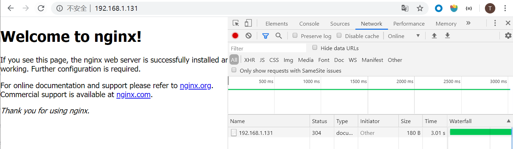

- 创建一个虚拟机，安装docker 19.03.8，安装chaosblade 0.5
- 初次使用时，会自动拉取chaosblade-tool镜像


# 实验：容器内cpu负载

容器内 CPU 负载实验场景，同基础资源的 CPU 场景

- 创建测试容器

```sh
root@ubuntu:/opt/module/chaosblade# docker run -d busybox sh -c "while true;do sleep 3600;done"
```

- 创建实验

```sh
# 先查询容器id
root@ubuntu:/opt/module/chaosblade# docker ps
CONTAINER ID        IMAGE               COMMAND                  CREATED             STATUS              PORTS                NAMES
c61d9f793dfb        busybox             "sh -c 'while true;d…"   6 seconds ago       Up 4 seconds                             laughing_ritchie

# 创建实验
root@ubuntu:/opt/module/chaosblade# ./blade create docker cpu load --cpu-percent 70 --image-version 0.5.0 --blade-tar-file /opt/soft/chaosblade-0.5.0.tar.gz --container-id c61d9f793dfb
{"code":200,"success":true,"result":"d5558ecafc44feb7"}
```

- 查看，进入容器内部查看cpu情况

```sh
docker exec -it c61d9f793dfb sh
/# top
```

- 销毁实验

```sh
./blade destroy d5558ecafc44feb7
```


## 问题

- 容器镜像没有ps命令，如nginx镜像，那么使用cpu负载的实验就会创建失败

```sh
{"code":503,"success":false,"error":"ps command not found"} A: 目标容器内没有 ps 命令
```


# 实验：容器内网络延时

- 创建一个nginx服务
- 开启实验
  - 测试访问nginx服务是否超时3s
  - 注意：初次创建需要拉取chaosblade-tool镜像，需要指定版本号，否则拉取超时
    - --image-version 0.5.0

```sh
root@ubuntu:/opt/module/chaosblade# ./blade create docker network delay --time 3000 --interface eth0 --local-port 80 --container-id d34b3fbdf3f4 --image-version 0.5.0
{"code":200,"success":true,"result":"80ed0929dbfa106d"}
```

- 结果生效



- 查看启动的容器
  - 新启动了一个名字为 d34b3fbdf3f4-delay 的容器，通过 sidecar 方式，复用目标容器网络，执行实验

```sh
root@ubuntu:/opt/module/chaosblade# docker ps
CONTAINER ID        IMAGE                                                                COMMAND                  CREATED             STATUS              PORTS                NAMES
83fe8b7be2a8        registry.cn-hangzhou.aliyuncs.com/chaosblade/chaosblade-tool:0.5.0   "/bin/sh -c '/opt/ch…"   2 minutes ago       Up 2 minutes                             d34b3fbdf3f4-delay
d34b3fbdf3f4        nginx                                                                "nginx -g 'daemon of…"   51 minutes ago      Up 51 minutes       0.0.0.0:80->80/tcp   web-nginx
```

- 销毁实验

```sh
root@ubuntu:/opt/module/chaosblade# ./blade destroy 80ed0929dbfa106d
{"code":200,"success":true,"result":"command: docker network delay  --container-id=d34b3fbdf3f4 --interface=eth0 --local-port=80 --time=3000 --image-version=0.5.0"}
```

- 查看容器，可以看到sidecar的delay容器被删除

```sh
root@ubuntu:/opt/module/chaosblade# docker ps -a
CONTAINER ID        IMAGE               COMMAND                  CREATED             STATUS                   PORTS                NAMES
d34b3fbdf3f4        nginx               "nginx -g 'daemon of…"   About an hour ago   Up About an hour         0.0.0.0:80->80/tcp   web-nginx
```


# 实验：容器网络丢包

- 创建实验
  - 注意 version

```sh
root@ubuntu:/opt/module/chaosblade# ./blade create docker network loss --container-id d34b3fbdf3f4 --percent 70 --local-port 80 --interface eth0 --image-version 0.5.0
{"code":200,"success":true,"result":"963b2a6b820807af"}
```

- 查看容器，含一个loss的容器

```sh
root@ubuntu:/opt/module/chaosblade# docker ps
CONTAINER ID        IMAGE                                                                COMMAND                  CREATED             STATUS              PORTS                NAMES
5354baafe1a9        registry.cn-hangzhou.aliyuncs.com/chaosblade/chaosblade-tool:0.5.0   "/bin/sh -c '/opt/ch…"   38 seconds ago      Up 38 seconds                            d34b3fbdf3f4-loss
d34b3fbdf3f4        nginx                                                                "nginx -g 'daemon of…"   About an hour ago   Up About an hour    0.0.0.0:80->80/tcp   web-nginx
```

- 销毁实验

```sh
blade destroy 963b2a6b820807af
```


# 实验：kill容器内指定进程

容器内进程场景，同基础资源进程场景

- 创建一个tomcat容器

```sh
FROM tomcat
WORKDIR /usr/local/tomcat/webapps/ROOT/
RUN rm -rf *
RUN echo "hello docker" > /usr/local/tomcat/webapps/ROOT/index.html
```

- 创建实验，kill 容器内的java进程

```sh
root@ubuntu:/opt/module/chaosblade# ./blade create docker process stop --process java --blade-tar-file /opt/soft/chaosblade-0.5.0.tar.gz --container-id a5abe85bf40a
```

- 原理
  - -process 内部使用 ps -ef | grep KEY 查找；--process-cmd 内部使用 pgrep 命令查找
  - 使用 kill -STOP PIDS 暂停进程，使用 kill -CONT PIDS 恢复进程


# 实验：删除容器

```sh
blade create docker container remove --container-id a5abe85bf40a
```

