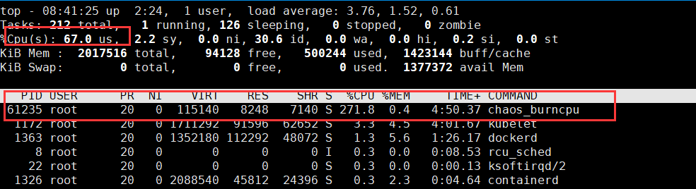

# 实验开始准备工作


## 安装chaosblade

- 注意安装的helm版本，v2和v3版本获取的ChaosBlade Operator版本也不同，执行 Kubernetes 实验场景，需要提前部署 ChaosBlade Operator，Helm 安装包下载地址：https://github.com/chaosblade-io/chaosblade-operator/releases 

- 使用以下命令安装:

```sh
helm install --namespace kube-system --name chaosblade-operator chaosblade-operator-0.5.0-v2.tgz
```

- 会安装在 kube-system 命令空间下。ChaosBlade Operator 启动后会在每个节点部署 chaosblade-tool Pod 和一个 chaosblade-operator Pod.可通过以下命令查看安装结果

```sh
kubectl get pod -n kube-system -o wide | grep chaosblade
# result
chaosblade-operator-5cc7b5b85-zcf2t    1/1     Running   0          115s    10.40.0.3       node1    <none>           <none>
chaosblade-tool-8f6lg                  1/1     Running   0          115s    192.168.1.136   node1    <none>           <none>
chaosblade-tool-j5csj                  1/1     Running   0          115s    192.168.1.135   master   <none>           <none>
chaosblade-tool-p4ln6                  1/1     Running   0          115s    192.168.1.134   node2    <none>           <none>
```

- 如果显示 chaosblade-operator 和 chaosblade-tool Pod 都处于 Running 状态，说明部署成功


## 配置实验网络环境

- 创建nginx的访问环境
- nginx-controller.yaml

```yml
apiVersion: v1
kind: ReplicationController
metadata:
  name: nginx-controller
spec:
  replicas: 1
  selector:
    name: nginx
  template:
    metadata:
      labels:
        name: nginx
    spec:
      containers:
        - name: nginx
          image: nginx
          ports:
            - containerPort: 80
```

- nginx-service-nodeport.yaml

```yaml
apiVersion: v1
kind: Service
metadata:
  name: nginx-service-nodeport
spec:
  ports:
    - port: 8000
      targetPort: 80
      protocol: TCP
  type: NodePort
  selector:
    name: nginx
```

- 创建pod

```sh
kubectl create -f nginx-controller.yaml
```

- 创建service

```sh
kubectl create -f nginx-service-nodeport.yaml
```

- 查看pod 和 service

```sh
root@master:/opt/test# kubectl get pods
NAME                     READY   STATUS    RESTARTS   AGE
nginx-controller-fmc8m   1/1     Running   0          36s
nginx-controller-nm9mv   1/1     Running   0          36s

root@master:/opt/test# kubectl get service
NAME                     TYPE        CLUSTER-IP    EXTERNAL-IP   PORT(S)          AGE
kubernetes               ClusterIP   10.96.0.1     <none>        443/TCP          8h
nginx-service-nodeport   NodePort    10.102.35.8   <none>        8000:30278/TCP   2m58s
```

- 查看service详细

```sh
root@master:/opt/test# kubectl describe service nginx-service-nodeport
Name:                     nginx-service-nodeport
Namespace:                default
Labels:                   <none>
Annotations:              <none>
Selector:                 name=nginx
Type:                     NodePort
IP:                       10.102.35.8
Port:                     <unset>  8000/TCP
TargetPort:               80/TCP
NodePort:                 <unset>  30278/TCP
Endpoints:                10.46.0.2:80,10.46.0.3:80
Session Affinity:         None
External Traffic Policy:  Cluster
Events:                   <none>
```

- 测试正常访问 http://192.168.1.135:30278/

- 创建busybox的pod的yaml文件

```yml
apiVersion: v1
kind: Pod
metadata:
  name: nginx-busybox
  namespace: demo # 如果不指定namespace，那么默认的namespace是default
spec:
  containers: #指定多个容器
  - name: nginx
    image: nginx
    ports:
    - containerPort: 80
  - name: busybox
    image: busybox
    command: ["/bin/sh"]
    args: ["-c","while true;do sleep 3600;done"]
```


```sh
apiVersion: v1
kind: Pod
metadata:
  name: nginx-busybox
  namespace: demo 
spec:
  containers: 
  - name: nginx
    image: nginx
    ports:
    - containerPort: 80
  - name: busybox
    image: busybox
    command: ["/bin/sh"]
    args: ["-c","while true;do sleep 3600;done"]
```


# 实验：给node的cpu添加负载

- 查看k8s上节点信息

```sh
root@master:/opt/soft# kubectl get nodes 
NAME     STATUS   ROLES    AGE     VERSION
master   Ready    master   6h48m   v1.18.1
node1    Ready    <none>   6h47m   v1.18.1
node2    Ready    <none>   6h47m   v1.18.1
```


## 方式1：通过yaml文件的方式


### 编写yml

-  chaosblade_cpu_load.yml

```yml
apiVersion: chaosblade.io/v1alpha1
kind: ChaosBlade
metadata:
  name: cpu-load
spec:
  experiments:
  - scope: node # 实验范围
    target: cpu # 目标对象
    action: fullload # 实施类型
    desc: "increase node cpu load by names"
    matchers: # 参数
    - name: names
      value:
      - "node1" # 要配置节点名称
    - name: cpu-percent # cpu负载百分比
      value:
      - "70"
```


### 创建&修改实验

```sh
root@master:/opt/soft# kubectl apply -f chaosblade_cpu_load.yml 
chaosblade.chaosblade.io/cpu-load created
```

- 查看实验状态

```sh
root@master:/opt/soft# kubectl get blade cpu-load -o wide
NAME       AGE
cpu-load   20m

root@master:/opt/soft# kubectl get blade cpu-load -o json
{
 ...
    "status": {
        "expStatuses": [
            {
                "action": "fullload",
                "resStatuses": [
                    {
                        "id": "ccc55e67bb2d2f36",
                        "kind": "node",
                        "name": "node1",
                        "nodeName": "node1",
                        "state": "Success",
                        "success": true,
                        "uid": "096820f8-9bf7-49e4-a03a-30bc8de35261"
                    }
                ],
                "scope": "node",
                "state": "Success",
                "success": true,
                "target": "cpu"
            }
        ],
        "phase": "Running"
    }
}
```

- 支持修改实验，修改yml文件后，再执行`kubectl apply -f chaosblade_cpu_load.yml` 即可


### 销毁实验

- 方式1：按配置文件终止

```sh
root@master:/opt/soft# kubectl delete -f chaosblade_cpu_load.yml
chaosblade.chaosblade.io "cpu-load" deleted
```

- 方式2：通过实验的资源名称终止实验
  - `kubectl delete chaosblade <metadata.name>`

```sh
root@master:/opt/soft# kubectl delete chaosblade cpu-load
chaosblade.chaosblade.io "cpu-load" deleted
```


### 分析结果

- 结果



- 观察启动的容器

```sh
root@node1:~# docker ps -f "name=chaos"
CONTAINER ID        IMAGE                                                              COMMAND                  CREATED             STATUS              PORTS               NAMES
213d044373f8        registry.cn-hangzhou.aliyuncs.com/chaosblade/chaosblade-operator   "chaosblade-operator…"   54 minutes ago      Up 54 minutes                           k8s_chaosblade-operator_chaosblade-operator-5cc7b5b85-zcf2t_kube-systemxxx
b5069b6c6c88        registry.cn-hangzhou.aliyuncs.com/chaosblade/chaosblade-tool       "sh -c 'tail -f /dev…"   54 minutes ago      Up 54 minutes                           k8s_chaosblade-tool_chaosblade-tool-8f6lg_kube-systemxxx
95ba8a94b717        k8s.gcr.io/pause:3.2                                               "/pause"                 55 minutes ago      Up 55 minutes                           k8s_POD_chaosblade-tool-8f6lg_kube-systemxxx
b1d2d9fcbee6        k8s.gcr.io/pause:3.2                                               "/pause"                 55 minutes ago      Up 55 minutes                           k8s_POD_chaosblade-operator-5cc7b5b85-zcf2t_kube-systemxxx
```


## 方式2：通过命令的方式

- 需要在节点上安装chaosblade工具包

```sh
root@master:/opt/module/chaosblade# ./blade create k8s node-cpu fullload \
--names node1 \
--cpu-percent 80 \
--kubeconfig ~/.kube/config
{"code":200,"success":true,"result":"00cd652dc14c914a"}
```

- 查询信息
  - 注意：**查询信息反馈失败，但实际上是成功了**

```sh
root@master:/opt/module/chaosblade# ./blade query k8s create 00cd652dc14c914a
{"code":800,"success":false,
"error":"unable to load in-cluster configuration, KUBERNETES_SERVICE_HOST and KUBERNETES_SERVICE_PORT must be defined",
"result":{"uid":"00cd652dc14c914a","success":false,"error":"unable to load in-cluster configuration, KUBERNETES_SERVICE_HOST and KUBERNETES_SERVICE_PORT must be defined",
"statuses":[{"id":"00cd652dc14c914a","state":"Error","kind":"","error":"unable to load in-cluster configuration, KUBERNETES_SERVICE_HOST and KUBERNETES_SERVICE_PORT must be defined","success":false}]}}
```

- 销毁实验

```sh
root@master:/opt/module/chaosblade# ./blade destroy 00cd652dc14c914a
{"code":200,"success":true,"result":"command: k8s node-cpu fullload  --kubeconfig=/root/.kube/config --cpu-percent=80 --names=node1"}
```


# 实验：给容器的cpu添加负载

- 场景特有参数

```sh
--container-ids string     容器ID，支持配置多个
--container-names string   容器名称，支持配置多个
--docker-endpoint string   Docker server 地址，默认为本地的 /var/run/docker.sock
--namespace string       Pod 所属的命名空间，只能填写一个值，必填项
--evict-count string     限制实验生效的数量
--evict-percent string   限制实验生效数量的百分比，不包含 %
--labels string          Pod 资源标签，多个标签之前是或的关系
--names string           Pod 资源名
--kubeconfig string      kubeconfig 文件全路径（仅限使用 blade 命令调用时使用）
--waiting-time string    实验结果等待时间，默认为 20s，参数值要包含单位，例如 10s，1m
```

- 指定 demo命名空间下 Pod 名为 nginx-busybox，通过容器id做 CPU 负载 100% 实验举例

```sh
root@master:/opt/module/chaosblade# kubectl get pods -A
NAMESPACE     NAME                                   READY   STATUS    RESTARTS   AGE
demo          nginx-busybox                          2/2     Running   0          3h11m
```

- 查询该pod下的容器信息

```sh
root@master:/opt/module/chaosblade# kubectl describe pod nginx-busybox -n demo
Name:         nginx-busybox
...
  busybox:
    Container ID:  docker://25929e65fd7fc2cef11ef10ab042cda3d2932e0e0d7536bf0772769b912e8c22
    Image:         busybox
...
```


## 方式1：通过yaml文件的方式

- 指定 default 命名空间下 Pod 名为 nginx-busybox下容器做 CPU 负载 100% 实验举例
  - 容器id为 25929e65fd7fc2cef11ef10ab042cda3d2932e0e0d7536bf0772769b912e8c22
- increase-container-cpu-load-by-id.yml

```yaml
apiVersion: chaosblade.io/v1alpha1
kind: ChaosBlade
metadata:
  name: increase-container-cpu-load-by-id
spec:
  experiments:
  - scope: container
    target: cpu
    action: fullload
    desc: "increase container cpu load by id"
    matchers:
    - name: container-ids
      value:
      - "25929e65fd7fc2cef11ef10ab042cda3d2932e0e0d7536bf0772769b912e8c22"
    - name: cpu-percent
      value: ["100"]
      # pod names
    - name: names
      value: ["nginx-busybox"]
    - name: namespace
      value: ["demo"]
```

- 创建实验

```sh
 kubectl apply -f increase_container_cpu_load_by_id.yml
```

- 查看实验的状态

```sh
root@master:/opt/test# kubectl get blade increase-container-cpu-load-by-id -o json
...
    "status": {
        "expStatuses": [
            {
                "action": "fullload",
                "resStatuses": [
                    {
                        "id": "25fa2d3f11761c26",
                        "kind": "container",
                        "name": "busybox",
                        "nodeName": "node2",
                        "state": "Success",
                        "success": true,
                        "uid": "25929e65fd7fc2cef11ef10ab042cda3d2932e0e0d7536bf0772769b912e8c22"
                    }
                ],
                "scope": "container",
                "state": "Success",
                "success": true,
                "target": "cpu"
            }
        ],
        "phase": "Running"
    }
}
```

- 查看目标容器的cpu变化
  - 在该容器内有一个chaosblade文件夹

```sh
root@master:/opt/test# kubectl exec nginx-busybox -n demo -c busybox -it -- sh
/ # ls -l /opt/
total 4
drwxr-xr-x    5 root     root          4096 Apr 16 09:49 chaosblade
/# top
Mem: 1868436K used, 149080K free, 1780K shrd, 98100K buff, 1200612K cached
CPU: 96.3% usr  0.8% sys  0.0% nic  2.7% idle  0.0% io  0.0% irq  0.0% sirq
Load average: 4.65 3.04 1.40 7/456 104
  PID  PPID USER     STAT   VSZ %VSZ CPU %CPU COMMAND
   77     1 root     S     112m  5.6   0 95.6 /opt/chaosblade/bin/chaos_burncpu --nohup --cpu-count 4 --cpu-percent 100
   99     0 root     S     1308  0.0   1  0.0 sh
  104    99 root     R     1304  0.0   3  0.0 top
    1     0 root     S     1300  0.0   2  0.0 /bin/sh -c while true;do sleep 3600;done
   27     1 root     S     1292  0.0   1  0.0 sleep 3600
```

- 销毁实验，chaosblade文件依然存在，但是chaos_burncpu进程已经销毁

```sh
root@master:/opt/test# kubectl delete chaosblade increase-container-cpu-load-by-id
chaosblade.chaosblade.io "increase-container-cpu-load-by-id" deleted
```


## 方式2：通过命令的方式

```sh
root@master:/opt/module/chaosblade# ./blade create k8s container-cpu fullload \
--cpu-percent 100 \
--container-ids 25929e65fd7fc2cef11ef10ab042cda3d2932e0e0d7536bf0772769b912e8c22 \
--names nginx-busybox \
--namespace demo \
--kubeconfig ~/.kube/config

root@master:/opt/module/chaosblade# ./blade destroy b22fec2dddadc727
{"code":200,"success":true,"result":"command: k8s container-cpu fullload  --container-ids=25929e65fd7fc2cef11ef10ab042cda3d2932e0e0d7536bf0772769b912e8c22 --kubeconfig=/root/.kube/config --namespace=demo --cpu-percent=100 --names=nginx-busybox"}
```


# 实验：给node网络访问丢包

- `blade create k8s node-network delay` 节点网络延迟场景
- `blade create k8s node-network loss` 节点网络丢包场景
- `blade create k8s node-network dns` 节点域名访问异常场景

- 特有参数

```sh
--evict-count string     限制实验生效的数量
--evict-percent string   限制实验生效数量的百分比，不包含 %
--labels string          节点资源标签
--names string           节点资源名，多个资源名之间使用逗号分隔
--kubeconfig string      kubeconfig 文件全路径（仅限使用 blade 命令调用时使用）
--waiting-time string    实验结果等待时间，默认为 20s，参数值要包含单位，例如 10s，1m
```


## 方式1：通过yaml文件的形式

- loss-node-network-by-names.yaml

```yaml
apiVersion: chaosblade.io/v1alpha1
kind: ChaosBlade
metadata:
  name: loss-node-network-by-names
spec:
  experiments:
  - scope: node
    target: network
    action: loss
    desc: "node network loss"
    matchers:
    - name: names
      value: ["node2"]
    - name: percent
      value: ["100"] # 100%丢包
    - name: interface
      value: ["ens33"] # 使用ubuntu进行测试，对ens33进行丢包测试，对centos使用eth0
    - name: local-port
      value: ["80"]
```

- 查看状态

```sh
root@master:/opt/test# kubectl apply -f loss-node-network-by-names.yaml 
chaosblade.chaosblade.io/loss-node-network-by-names created
# 查看状态
root@master:/opt/test# kubectl get blade loss-node-network-by-names -o json
```

- 测试
  - node2在实验中是192.168.1.134

```sh
curl 192.168.1.134:80
```

- 销毁实验

```sh
root@master:/opt/test# kubectl delete -f loss-node-network-by-names.yaml 
chaosblade.chaosblade.io "loss-node-network-by-names" deleted
```


## 方式2：通过命令的方式

```sh
root@master:/opt/module/chaosblade# ./blade create k8s node-network loss --percent 100 --interface ens33 --local-port 80 \
--kubeconfig ~/.kube/config \
--names node2
{"code":200,"success":true,"result":"21b9d9f8125e8eb0"}

root@master:/opt/module/chaosblade# ./blade destroy 21b9d9f8125e8eb0
{"code":200,"success":true,"result":"command: k8s node-network loss  --local-port=80 --interface=ens33 --kubeconfig=/root/.kube/config --names=node2 --percent=100"}
```


# 实验：给node网络访问添加延时

- 通过yaml的方式
- delay-node-network-by-names.yaml

```yaml
apiVersion: chaosblade.io/v1alpha1
kind: ChaosBlade
metadata:
  name: delay-node-network-by-names
spec:
  experiments:
  - scope: node
    target: network
    action: delay
    desc: "node network delay"
    matchers:
    - name: names
      value: ["node2"]
    - name: time
      value: ["3000"] 
    - name: interface
      value: ["ens33"] # 使用ubuntu进行测试，对ens33进行丢包测试，对centos使用eth0
    - name: local-port
      value: ["80"]
```

- 执行

```sh
root@master:/opt/test# kubectl apply -f delay-node-network-by-names.yaml 
chaosblade.chaosblade.io/delay-node-network-by-names created

root@master:/opt/test# kubectl get blade delay-node-network-by-names -o json

# 测试
curl 192.168.1.134:80

# 销毁
root@master:/opt/test# kubectl delete -f delay-node-network-by-names.yaml 
```

- 通过命令的方式

```sh
./blade create k8s node-network delay \
--names node2 \
--kubeconfig ~/.kube/config \
--time 3000 \
--interface ens33 \
--local-port 80
{"code":200,"success":true,"result":"be98d950d20aa0ac"}
# 测试
curl 192.168.1.134:80
# 销毁
/blade destroy be98d950d20aa0ac
```


# 实验：杀死node上指定进程

- 特定参数

```sh
--evict-count string     限制实验生效的数量
--evict-percent string   限制实验生效数量的百分比，不包含 %
--labels string          节点资源标签
--names string           节点资源名，多个资源名之间使用逗号分隔
--kubeconfig string      kubeconfig 文件全路径（仅限使用 blade 命令调用时使用）
--waiting-time string    实验结果等待时间，默认为 20s，参数值要包含单位，例如 10s，1m
```

- 杀指定 node2 节点上 nginx进程


## 方式1：通过yaml文件的方式

- kill-node-process-by-names.yaml

```yaml
apiVersion: chaosblade.io/v1alpha1
kind: ChaosBlade
metadata:
  name: kill-node-process-by-names
spec:
  experiments:
  - scope: node
    target: process
    action: kill
    desc: "kill node process by names"
    matchers:
    - name: names
      value: ["node2"]
    - name: process
      value: ["nginx"]
```

- 创建实验
  - 问题：查看详情情况是生成失败了，但是实验生效了，待解决

```sh
root@master:/opt/test# kubectl apply -f kill-node-process-by-names.yaml 
chaosblade.chaosblade.io/kill-node-process-by-names created

# 查看结果
root@master:/opt/test# kubectl get blade kill-node-process-by-names -o json
...
status": {
        "expStatuses": [
            {
                "action": "kill",
                "error": "see resStatus for the error details",
                "resStatuses": [
                    {
                        "error": "sh: invalid number '110741110719nginx:'\nsh: invalid number '110775110741nginx:'\n exit status 2 exit status 1",
                        "kind": "node",
                        "name": "node2",
                        "nodeName": "node2",
                        "state": "Error",
                        "success": false,
                        "uid": "0e8ed8a6-a562-40ad-84f7-6726e1e5cdfa"
                    }
                ],
                "scope": "node",
                "state": "Error",
                "success": false,
                "target": "process"
            }
        ],
        "phase": "Error"
    }
}
```

- 查看已经生效了，在node2节点上nginx-busybox 中的nginx进程被杀掉重启了

```sh
root@master:/opt/module/chaosblade# kubectl get pods -A -o wide
NAMESPACE     NAME                                   READY   STATUS             RESTARTS   AGE     IP              NODE     NOMINATED NODE   READINESS GATES
default       nginx-controller-nm9mv                 1/1     Running            0          83m     10.46.0.2       node2    <none>           <none>
demo          nginx-busybox                          1/2     CrashLoopBackOff   4          5h44m   10.46.0.1       node2    <none>           <no
```

- 销毁实验

```sh
root@master:/opt/test# kubectl delete -f kill-node-process-by-names.yaml 
chaosblade.chaosblade.io "kill-node-process-by-names" deleted kuberoot@master:/opt/test# kubectl apply -f kill-node-process-by-names.yaml chaosblade.chaosblade.io/kill-node-process-by-names createdroot@master:/opt/test# kubectl delete -f kill-node-process-by-names.yaml chaosblade.chaosblade.io "kill-node-process-by-names" deletedsh
```


## 方式2：通过命令的方式

```sh
# 创建
blade create k8s node-process kill --process nginx \
--names node2 \
--kubeconfig  ~/.kube/config

# 销毁
blade destroy <result_id>
```


# 实验：删除pod

- 特有参数

```sh
--namespace string       Pod 所属的命名空间，只能填写一个值，必填项
--evict-count string     限制实验生效的数量
--evict-percent string   限制实验生效数量的百分比，不包含 %
--labels string          Pod 资源标签，多个标签之前是或的关系
--names string           Pod 资源名
--kubeconfig string      kubeconfig 文件全路径（仅限使用 blade 命令调用时使用）
--waiting-time string    实验结果等待时间，默认为 20s，参数值要包含单位，例如 10s，1m
```

- 删除指定 demo 命名空间下标签是 app=busybox的 pod，由于该pod非deployment产生，删除后不会重启

## 方式1：yaml方式

- pod-delete.yaml

```yml
apiVersion: chaosblade.io/v1alpha1
kind: ChaosBlade
metadata:
  name: delete-pod-by-names
spec:
  experiments:
  - scope: pod
    target: pod
    action: delete
    desc: "delete pod by labels"
    matchers:
    - name: names
      value:
      - "nginx-busybox"
    - name: namespace
      value:
      - "demo"
    - name: evict-count
      value:
      - "1"
```

- 执行

```sh
root@master:/opt/test# kubectl apply -f pod-delete.yaml 
```

- 销毁

```sh
root@master:/opt/test# kubectl delete -f pod-delete.yaml 
```

- 观察

```sh
# 执行前
root@master:/opt/module/chaosblade# kubectl get pods -A -o wide
NAMESPACE     NAME                                   READY   STATUS    RESTARTS   AGE     IP              NODE     NOMINATED NODE   READINESS GATES
default       nginx-controller-nm9mv                 1/1     Running   0          96m     10.46.0.2       node2    <none>           <none>
demo          nginx-busybox                          2/2     Running   5          5h57m   10.46.0.1       node2    <none>           <none>
...

# 执行后，生效
root@master:/opt/module/chaosblade# kubectl get pods -A -o wide
NAMESPACE     NAME                                   READY   STATUS        RESTARTS   AGE     IP              NODE     NOMINATED NODE   READINESS GATES
default       nginx-controller-nm9mv                 1/1     Running       0          96m     10.46.0.2       node2    <none>           <none>
demo          nginx-busybox                          2/2     Terminating   5          5h57m   10.46.0.1       node2    <none>           <none>
...
```


## 方式2：命令方式

```sh
# 创建
./blade create k8s pod-pod delete \
--names=nginx-busybox \
--namespace demo \
--evict-count 1 \
--kubeconfig ~/.kube/config

# 销毁
./blade destroy xxx
```


# 实验：给指定pod网络延时

- 支持的网络场景命令如下：
  - `blade create k8s pod-network delay` Pod 网络延迟场景
  - `blade create k8s pod-network loss` Pod 网络丢包场景
  - `blade create k8s pod-network dns` Pod 域名访问异常场景

- 特定参数

```sh
--namespace string       Pod 所属的命名空间，只能填写一个值，必填项
--evict-count string     限制实验生效的数量
--evict-percent string   限制实验生效数量的百分比，不包含 %
--labels string          Pod 资源标签，多个标签之前是或的关系
--names string           Pod 资源名
--kubeconfig string      kubeconfig 文件全路径（仅限使用 blade 命令调用时使用）
--waiting-time string    实验结果等待时间，默认为 20s，参数值要包含单位，例如 10s，1m
```


## 方式1：yaml方式

- delay-pod-network-by-names.yaml

```yaml
apiVersion: chaosblade.io/v1alpha1
kind: ChaosBlade
metadata:
  name: delay-pod-network-by-names
spec:
  experiments:
  - scope: pod
    target: network
    action: delay
    desc: "delay pod network by names"
    matchers:
    - name: names
      value:
      - "nginx-controller-nm9mv"
    - name: namespace
      value:
      - "default"
    - name: local-port
      value: ["80"]
    - name: interface
      value: ["eth0"]
    - name: time
      value: ["3000"]
    - name: offset
      value: ["1000"]
```

- 创建实验

```sh
root@master:/opt/test# kubectl apply -f delay-pod-network-by-names.yaml 
```

- 测试访问 http://192.168.1.135:30278/ 延时生效
- 销毁实验

```sh
root@master:/opt/test# kubectl delete -f delay-pod-network-by-names.yaml 
```


## 方式2：命令方式

- 创建实验

```sh
blade create k8s pod-network delay \
--time 3000 --offset 1000 \
--interface eth0 \
--local-port 80 \
--names nginx-controller-nm9mv \
--namespace default \
--kubeconfig ~/.kube/config

{"code":200,"success":true,"result":"6f38366d421dea21"}
```

- 访问 http://192.168.1.135:30278/ 延时生效
- 销毁实验

```sh
root@master:/opt/module/chaosblade# ./blade destroy 6f38366d421dea21
```


# 实验：容器内网络dns修改，访问异常

kubernetes 下 容器内网络实验场景，同基础资源网络场景，由于同一个 Pod 内的容器共享 Pod 网络，所以效果同对 Pod 网络实验

支持的网络场景命令如下：

- `blade create k8s container-network delay` container 网络延迟场景
- `blade create k8s container-network loss` container 网络丢包场景
- `blade create k8s container-network dns` container 域名访问异常场景

- 特有参数

```sh
--container-ids string     容器ID，支持配置多个
--container-names string   容器名称，支持配置多个
--docker-endpoint string   Docker server 地址，默认为本地的 /var/run/docker.sock
--namespace string       Pod 所属的命名空间，只能填写一个值，必填项
--evict-count string     限制实验生效的数量
--evict-percent string   限制实验生效数量的百分比，不包含 %
--labels string          Pod 资源标签，多个标签之前是或的关系
--names string           Pod 资源名
--kubeconfig string      kubeconfig 文件全路径（仅限使用 blade 命令调用时使用）
--waiting-time string    实验结果等待时间，默认为 20s，参数值要包含单位，例如 10s，1m
```

- 查看pod

```sh
root@master:/opt/module/chaosblade# kubectl get pods -A -o wide
NAMESPACE     NAME                                   READY   STATUS    RESTARTS   AGE     IP              NODE     NOMINATED NODE   READINESS GATES
...
demo          nginx-busybox                          2/2     Running   0          2m23s   10.46.0.1       node2    <none>           <none>
...
```


## 方式1：yaml方式

- tamper-container-dns-by-id.yaml

```yaml
apiVersion: chaosblade.io/v1alpha1
kind: ChaosBlade
metadata:
  name: tamper-container-dns-by-id
spec:
  experiments:
  - scope: container
    target: network
    action: dns
    desc: "tamper container dns by id"
    matchers:
    - name: container-ids
      value:
      - "44535d3be0c5c70084bb285e557892627aab654c53f98444268a39e7cb591a4e"
    - name: domain
      value: ["www.baidu.com"]
    - name: ip
      value: ["10.46.0.1"]
    - name: names
      value: ["nginx-busybox"]
    - name: namespace
      value: ["demo"]
```

- 创建实验

```sh
root@master:/opt/test# kubectl apply -f tamper-container-dns-by-id.yaml 
```

- 实验后检测

```sh
root@master:/opt/module/chaosblade# kubectl exec -n demo -it nginx-busybox -- sh
/ # wget www.baidu.com
...
/ # cat index.html 
<!DOCTYPE html>
<html>
<head>
<title>Welcome to nginx!</title>
<style>
    body {
        width: 35em;
        margin: 0 auto;
        font-family: Tahoma, Verdana, Arial, sans-serif;
        ...
```

- 销毁实验

```sh
root@master:/opt/test# kubectl delete -f tamper-container-dns-by-id.yaml 
```

- 销毁实验后检测

```sh
# 容器内访问
root@master:/opt/module/chaosblade# kubectl exec -n demo -it nginx-busybox -c busybox -- sh
/ # wget www.baidu.com
...
/ # cat index.html 
<!DOCTYPE html>
!--STATUS OK--><html> <head><meta http-equiv=content-type content=text/html;charset=utf-8><meta http-equiv=X-UA-Compatible content=IE=Edge><meta content=always name=referrer><link rel=stylesheet type=text/css href=http://s1.bdstatic.com/r/www/cache/bdorz/baidu.min.css><title>百度一下，你就知道</title></head> <body link=#0000cc> <div id=wrapper> <div id=head> <div class=head_wrapper> <div class=s_form> <div class=s_form_wrapper> <div id=lg>  </div> <form id=form name=f action=//www.baidu.com/s class=fm> <input type=hidden name=bdorz_come value=1> <input type=hidden name=ie value=utf-8> <input type=hidden name=f value=8> <input type=hidden name=rsv_bp value=1> <input type=hidden name=rsv_idx value=1> <input type=hidden name=tn value=baidu><span class="bg s_ipt_wr"><input id=kw name=wd class=s_ipt value maxlength=255 autocomplete=off autofocus></span><span class="b
```


## 方式2：命令方式

```sh
blade create k8s container-network dns \
--domain www.baidu.com \
--ip 10.46.0.1 \
--names nginx-busybox \
--namespace demo \
--container-ids 44535d3be0c5c70084bb285e557892627aab654c53f98444268a39e7cb591a4e \
--kubeconfig ~/.kube/config

{"code":200,"success":true,"result":"f0724c0948a301ac"}

# 销毁测试
blade destroy f0724c0948a301ac
```


# 实验：容器内杀死进程

支持的进程场景命令如下：

- `blade create k8s container-process kill` 杀容器内指定进程
- `blade create k8s container-process stop` 挂起容器内指定进程

- 特殊参数

```sh
--container-ids string     容器ID，支持配置多个
--container-names string   容器名称，支持配置多个
--docker-endpoint string   Docker server 地址，默认为本地的 /var/run/docker.sock
--namespace string       Pod 所属的命名空间，只能填写一个值，必填项
--evict-count string     限制实验生效的数量
--evict-percent string   限制实验生效数量的百分比，不包含 %
--labels string          Pod 资源标签，多个标签之前是或的关系
--names string           Pod 资源名
--kubeconfig string      kubeconfig 文件全路径（仅限使用 blade 命令调用时使用）
--waiting-time string    实验结果等待时间，默认为 20s，参数值要包含单位，例如 10s，1m
```

- 指定 demo命名空间下 Pod 名是 nginx-busybox，容器id为 52c10a9a01f4，进程名为 nginx 的进程


## 方式1：yaml方式

- 创建kill-container-process-by-id.yml

```sh
apiVersion: chaosblade.io/v1alpha1
kind: ChaosBlade
metadata:
  name: kill-container-process-by-id
spec:
  experiments:
  - scope: container
    target: process
    action: kill
    desc: "kill container process by id"
    matchers:
    - name: container-ids
      value:
      - "52c10a9a01f4"
    - name: process
      value: ["nginx"]
    - name: names
      value: ["nginx-busybox"]      
    - name: namespace
      value: ["demo"]
```

- 创建实验

```sh
kubectl apply -f kill-container-process-by-id.yml
```

- 销毁实验

```sh
kubectl delete -f kill-container-process-by-id.yml
```


## 方式2：命令方式

- 创建实验

```sh
blade create k8s container-process kill \
--process nginx  \
--names nginx-busybox \
--container-ids 52c10a9a01f4 \
--namespace demo \
--kubeconfig ~/.kube/config
```

- 销毁实验

```sh
blade destroy xxx
```


# 实验：删除容器

Kubernetes 下 container 资源自身的场景，比如删容器，需要注意，执行容器场景，必须先确定 Pod，所以需要配置 Pod 相关参数

`blade create k8s container-container remove` 删除容器 

- 特定参数

```sh
--container-ids string     容器ID，支持配置多个
--container-names string   容器名称，支持配置多个
--docker-endpoint string   Docker server 地址，默认为本地的 /var/run/docker.sock
--namespace string       Pod 所属的命名空间，只能填写一个值，必填项
--evict-count string     限制实验生效的数量
--evict-percent string   限制实验生效数量的百分比，不包含 %
--labels string          Pod 资源标签，多个标签之前是或的关系
--names string           Pod 资源名
--kubeconfig string      kubeconfig 文件全路径（仅限使用 blade 命令调用时使用）
--waiting-time string    实验结果等待时间，默认为 20s，参数值要包含单位，例如 10s，1m
--force                    是否强制删除
```

- 删除 demo命名空间下，Pod 名为 nginx-busybox 下的 container id 是 44535d3be0c5的容器(busybox容器)


## 方式1：yaml方式

- remove-container-by-id.yaml

```yaml
apiVersion: chaosblade.io/v1alpha1
kind: ChaosBlade
metadata:
  name: remove-container-by-id
spec:
  experiments:
  - scope: container
    target: container
    action: remove
    desc: "remove container by id"
    matchers:
    - name: container-ids
      value: ["5d30febb1721"]
      # pod name
    - name: names
      value: ["nginx-busybox"]
    - name: namespace
      value: ["demo"]
```

- 创建实验

```sh
root@master:/opt/test# kubectl apply -f remove-container-by-id.yaml 
chaosblade.chaosblade.io/remove-container-by-id created
```

- 查看pod容器状态

```sh
root@master:/opt/module/chaosblade# kubectl get pods -A -o wide
NAMESPACE     NAME                                   READY   STATUS              RESTARTS   AGE     IP              NODE     NOMINATED NODE   READINESS GATES
...
demo          nginx-busybox                          1/2     ContainerCreating   0          50m     10.46.0.1       node2    <none>           <none>
...
```

- 销毁实验

```sh
root@master:/opt/test# kubectl delete -f remove-container-by-id.yaml
```


## 方式2：命令方式

```sh
blade create k8s container-container remove \
--container-ids 44535d3be0c5 \
--names nginx-busybox \
--namespace demo \
--kubeconfig ~/.kube/config
```

- 销毁实验

```sh
blade destroy xxxx
```


# 实验结束工作

- 销毁所有实验
- 卸载实验的pod

```sh
helm del --purge chaosblade-operator
```

