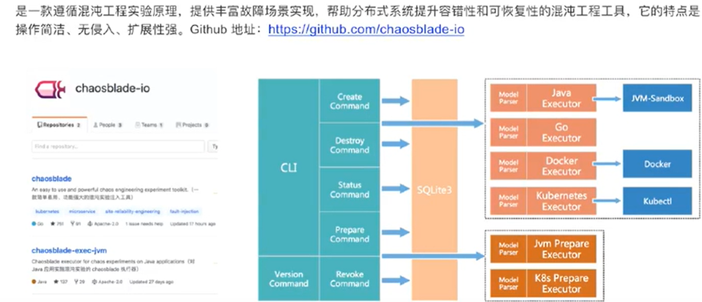
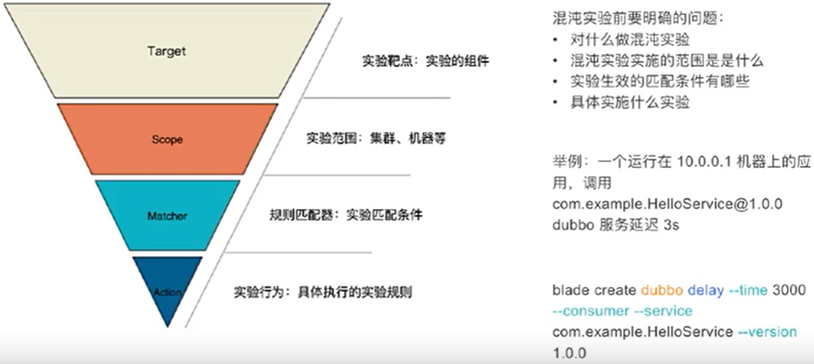
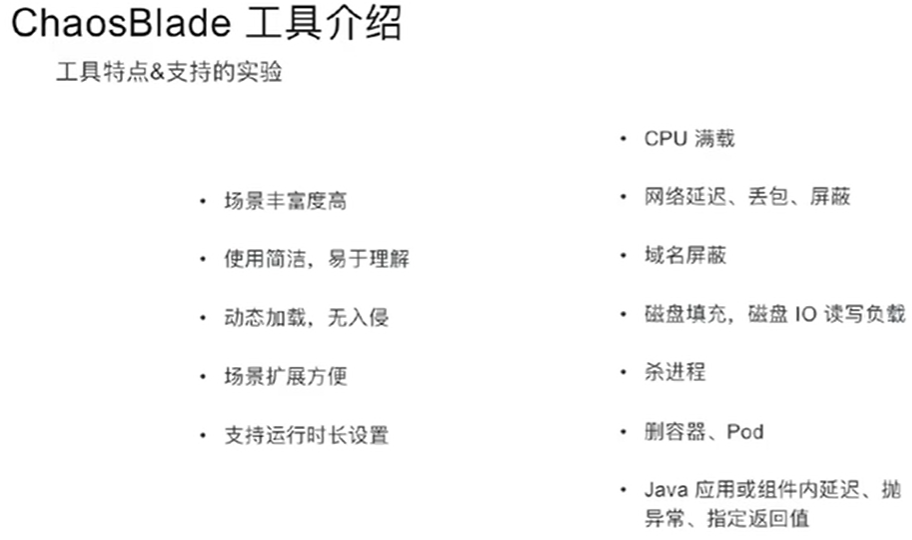
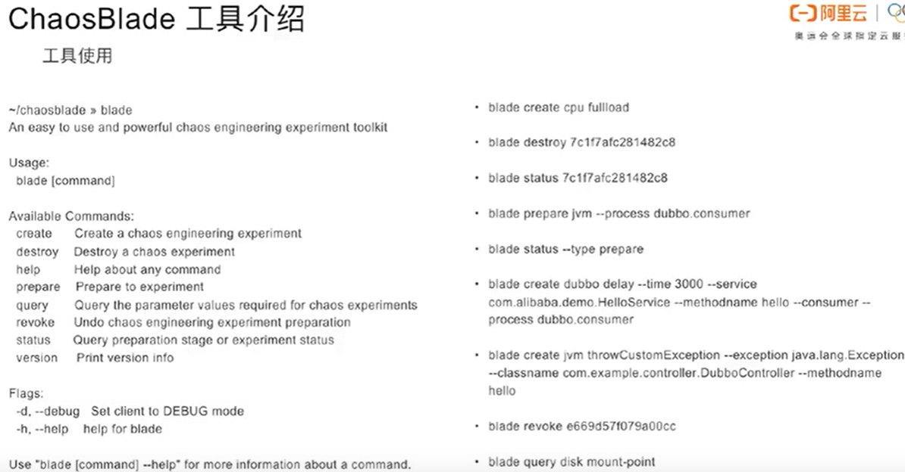
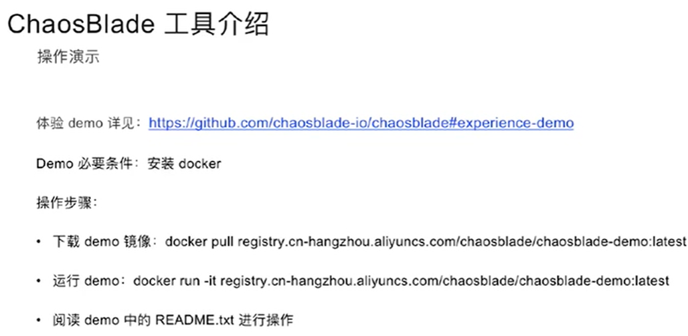
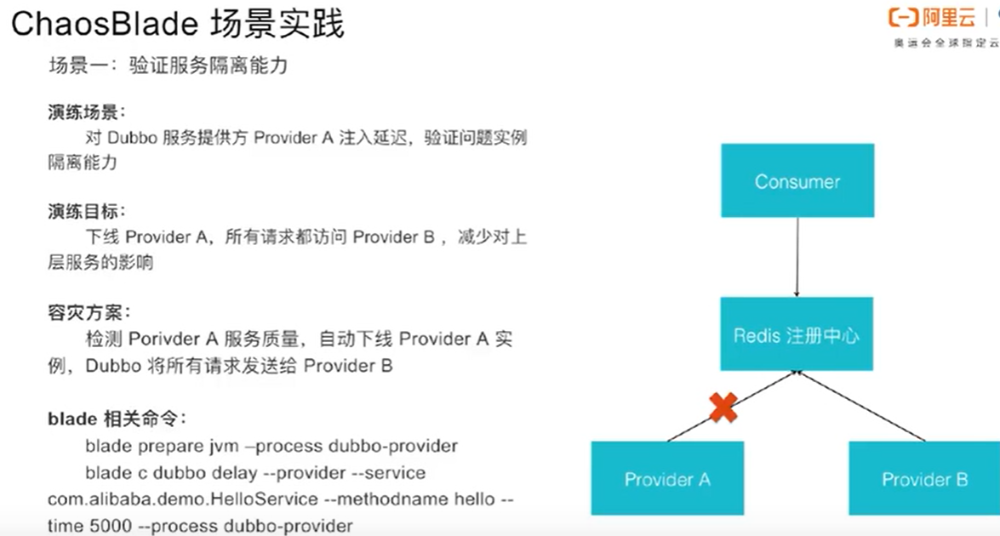
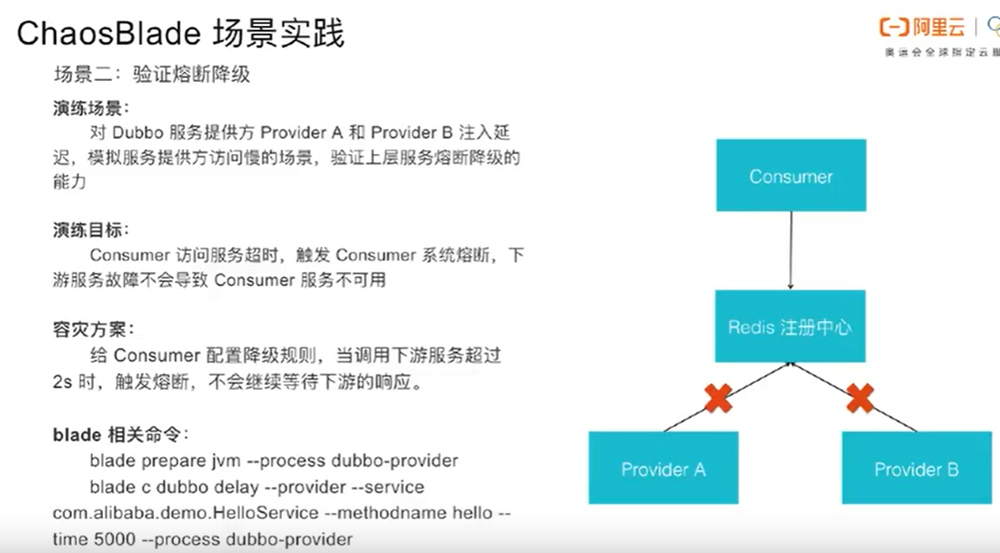
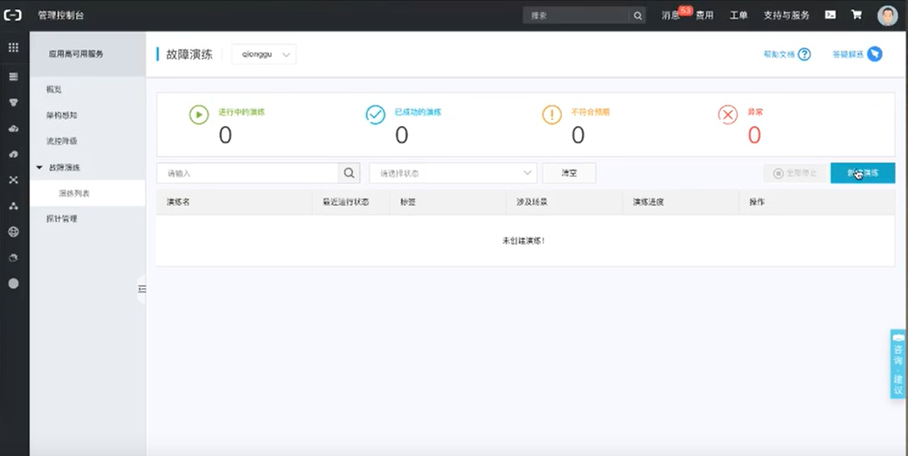
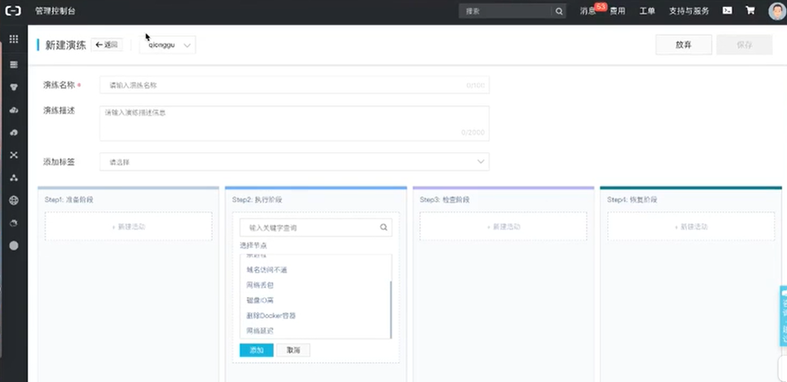
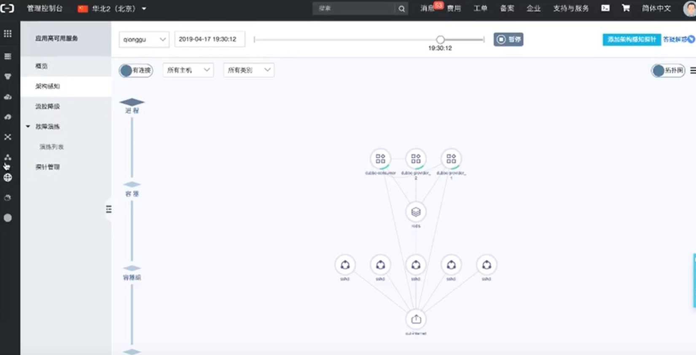

混沌工程

 


ChaosBlade






 





```bash
docker pull chaosbladeio/chaosblade-demo

docker run -it --privileged chaosbladeio/chaosblade-demo
```

```bash
# Command example

# The application is a simple dubbo demo, so you can test java application chaos experiment, and execute
#[ curl http://localhost:8080/dubbo/hello?name=dubbo ] command to call the service for checking experiment
curl http://localhost:8080/dubbo/hello?name=dubbo

#Hello dubbo, response from provider: 172.17.0.2:20880

# Prepare java application experiment
blade prepare jvm --process business
# or
blade p jvm --process business

# Create a experiment is delay 3s when invoke com.example.service.DemoService#sayHello service,	

# 开启一个dubbo测试服务，延时3s 对com.example.service.DemoService进行测试，方法名称methodname

blade create dubbo delay --time 3000 --service com.example.service.DemoService --methodname sayHello --consumer # 标识是一个消费者

# {"code":200,"success":true,"result":"c658d34746723d08"} # 该result是该business的ID

# 查询create的状态 
bash-4.4# blade status --type create # 可以缩写为c
{
        "code": 200,
        "success": true,
        "result": [
                {
                        "Uid": "c658d34746723d08",
                        "Command": "dubbo",
                        "SubCommand": "delay",
                        "Flag": "--consumer true --provider false --time 3000 --service com.example.service.DemoService --debug false --help false --methodname sayHello",
                        "Status": "Success",
                        "Error": "",
                        "CreateTime": "2020-04-02T10:34:25.625731931Z",
                        "UpdateTime": "2020-04-02T10:34:25.65100696Z"
                }
        ]
}

# 该dubbo服务的超时时间是1s
bash-4.4# curl http://localhost:8080/dubbo/hello?name=dubbo
chaosblade-mock-TimeoutException,timeout=1000

# or
blade c dubbo delay --time 3000 --service com.example.service.DemoService --methodname sayHello --consumer

# Execute curl http://localhost:8080/dubbo/hello?name=dubbo again to check the service status.
# Destroy the experiment, <UID> is the create command result.
blade destroy <UID>
#or
blade d <UID>

# 销毁该实验，然后再测试延时300ms，就显示成功了
blade destroy c658d34746723d08

# Execute curl http://localhost:8080/dubbo/hello?name=dubbo again to check the service status.
# You can use status command to query the experiment status
blade status --type create
blade status <UID>
#or
blade s <UID>

# Create a experiment is throwing exception when request hello controller service(the request mapping method name is
# hello too)
blade create jvm throwCustomException --exception java.lang.Exception \
    --classname com.example.controller.DubboController --methodname hello

# Destroy the experiment
blade destroy UID

# Burn cpu, execute the flow command and use top command to check cpu stats. You can execute destroy command to stop the

# top 先查看一下负载情况

# experiment 创建cpu负载 只能满负载，可以通过核数控制
blade create cpu fullload

# You can also add --timeout flag to set the experiment duration, the unit of timeout flag is second
blade create cpu fullload --timeout 30

# You can use help command to discover other experiment, enjoy it.
blade help
```


## dubbo delay

```bash
Usage:
  blade create dubbo delay

Flags:
      --appname string          The consumer or provider application name
      --consumer                To tag consumer role experiment.
      --effect-count string     The count of chaos experiment in effect
      --effect-percent string   The percent of chaos experiment in effect
      --group string            The service group
  -h, --help                    help for delay
      --methodname string       The method name
      --offset string           delay offset for the time
      --process string          Application process name
      --provider                To tag provider experiment
      --service string          The service interface
      --time string             delay time (required) #
      --timeout string          set timeout for experiment #
      --version string          the service version

Global Flags:
  -d, --debug   Set client to DEBUG mode
```


## cpu fullload

```bash
bash-4.4# blade create cpu fullload -h
cpu fullload

Usage:
  blade create cpu fullload

Aliases:
  fullload, fl

Flags:
  -h, --help             help for fullload
      --timeout string   set timeout for experiment

Global Flags:
      --cpu-count string   Cpu count
      --cpu-list string    CPUs in which to allow burning (0-3 or 1,3)
  -d, --debug              Set client to DEBUG mode
```


## 场景实践



- 当providerA有延时，要求该服务下线，防止对上游服务的影响，即服务隔离
  - 保证正常的流量访问正常的服务





## AHAS




- 点击新建






## create process kill

```bash
bash-4.4# blade create process kill -h
Kill process by process id or process name

Usage:
  blade create process kill

Aliases:
  kill, k

Flags:
  -h, --help                 help for kill
      --process string       Process name
      --process-cmd string   Process name in command
      --timeout string       set timeout for experimentoad --debug false --help false"}
bash-4.4# top
Global Flags:
  -d, --debug   Set client to DEBUG mode
```


